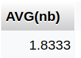

# Requêtes de l'application

[Syntaxe Markdown](https://www.markdownguide.org/basic-syntax/)

## Sélectionner le nombre d'événements groupés par lieu

On utilise COUNT(*) en combinaison avec GROUP BY pour compter les événements par lieu.

```sql
SELECT lieu.id_lieu,lieu.nom,COUNT(*) as nbEvenements FROM `evenement`
JOIN lieu ON evenement.id_lieu=lieu.id_lieu
GROUP BY id_lieu
```

---

## Moyenne d'utilisateurs inscrits à des événements

> On utilise une sous-requête qui compte les utilsateurs par événement.
On fait ensuite la moyenne de ces valeurs.
On doit attribuer un alias pour la sous-requête.

```sql
SELECT AVG(nb) FROM
(SELECT COUNT(*) as nb
FROM utilisateur_evenement 
GROUP BY id_evenement) AS sub
```

